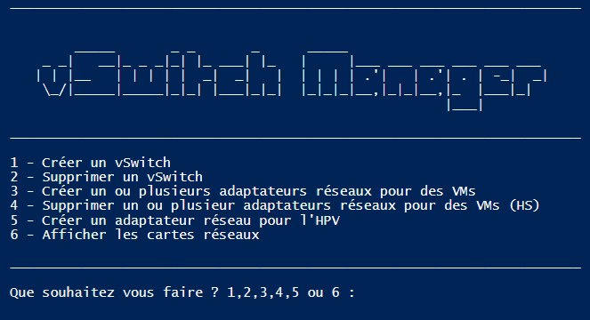

# vSwitch-Manager
 FR - vSwitch Manager est un Script PowerShell qui permet d'aider à mettre en place des vSwitch Windows Server.
 
  Il vous suffit juste de téléhcrager le fichier .ps1 et de l'exécuter sur la machine cible

