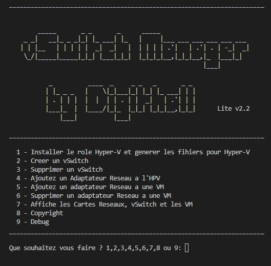
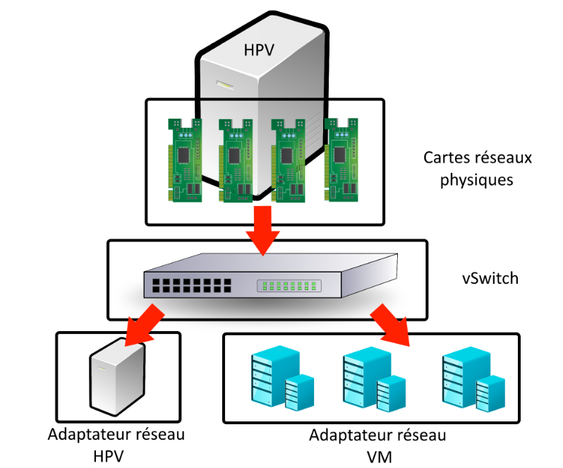

  vSwitch Manager est un Script PowerShell qui permet d'aider à mettre en place des vSwitch Windows Server.
  Il vous suffit juste de téléhcrager le fichier .ps1 et de l'exécuter sur la machine cible

  Il faut reproduire cette configuration, donc il faut créer un commutateur réseau avec l’ensemble des cartes réseaux, puis il faut créer un vSwitch et connecter les VM et l’HPV à ce même vSwitch.

  Exemple pour créer ce schéma il faut,
-	Créer un commutateur réseau, à l’aide du gestionnaire de serveur
-	Créer un vSwitch, à l’aide du script
-	Ajouter un adaptateurs Réseau à l’HPV, à l’aide du script
-	Ajouter les adaptateurs Réseau aux VM, à l’aide du script

